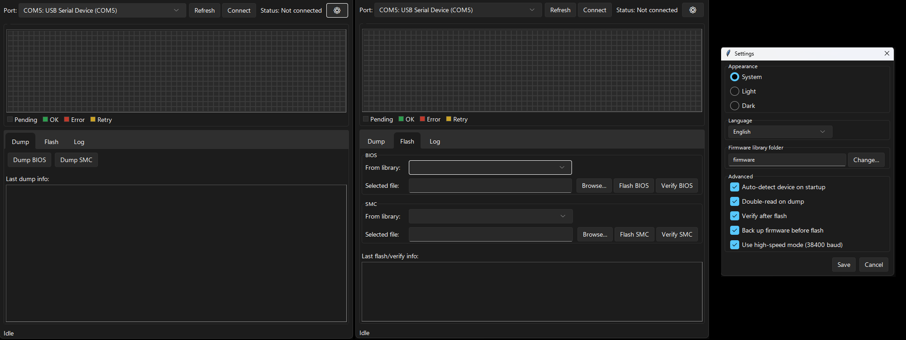

# Xyclops Firmware Utility (XFU)

A GUI for the [Xyclops programmer](https://github.com/Club-Michas/Xyclops-Firmware-Utility):
dump, verify, and flash BIOS and SMC firmware on **Xbox 1.6** consoles.



---

## ⚠️ Before you start

Flashing firmware is risky. A bad write can brick your console.

- **Back up your original firmware first.** XFU does this automatically before every write, but verify the backup landed on disk.
- **Use a stable power source.** Don't flash on battery, don't unplug mid-operation.
- **Test on a spare console if you have one.** This release is not yet hardware-validated by a wide user base.
- **Keep the original command-line tool handy** as a recovery path.

If you're not comfortable with those conditions, don't run this yet.

---

## ✨ What it does

**Dump**
: Reads the BIOS (256 KiB) or SMC (16 KiB) over the Xyclops serial interface. Double-read mode reads twice and compares, so corrupted reads are caught before you rely on them.

**Verify**
: Compares an on-disk image against what's actually on the console, block by block. Useful before and after flashing.

**Flash**
: Erases, writes, and optionally verifies target firmware. A **backup of the current contents is taken automatically** before anything is erased.

**Library**
: Keeps BIOS and SMC images in one folder, so you're not hunting through the filesystem every time.

---

## 🤔 Why it exists

The reference tools work, but they're command-line scripts with no safety net.

XFU adds:

- Automatic device detection
- Per-block progress feedback
- MD5 / SHA-1 / SHA-256 verification
- **Backups before every destructive step**
- Clear, actionable error reporting

Same protocol underneath. Safer wrapper on top.

---

## 📋 Requirements

| | |
|---|---|
| **Python** | 3.10 or newer |
| **Required** | [`pyserial`](https://pypi.org/project/pyserial/) |
| **Hardware** | Xyclops programmer, connected via USB-serial |
| **Optional** | [`sv-ttk`](https://pypi.org/project/sv-ttk/) for a native Windows 11 dark theme |
| **Console** | Xbox 1.6 |

Install dependencies:

```bash
pip install pyserial
pip install sv-ttk   # optional, for dark mode
